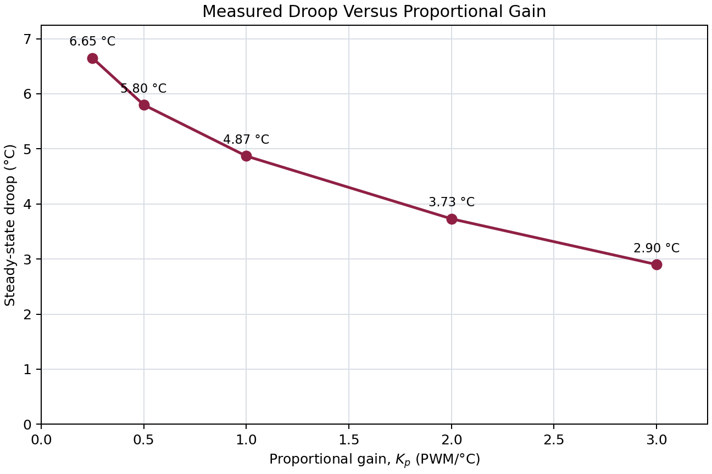

# Part 3: Measure Droop Versus Gain

## Gain selection

Use the corrected Module 4 heating susceptibility:

$$
\chi_{T,h}=0.4872\ ^\circ\mathrm C/\text{PWM count}.
$$

For $T_{\mathrm{amb}}=22^\circ$C and $T_{\mathrm{set}}=30^\circ$C:

$$
e_0=T_{\mathrm{set}}-T_{\mathrm{amb}}=8^\circ\mathrm C,
$$

$$
P_{\mathrm{required}}\approx\frac{8}{0.4872}=16.4,
\qquad
P_0=K_p|e_0|=8K_p.
$$

Have the instructor approve the gain sequence before running it.

## Results

For every gain, begin with PWM 0, enable P-only mode, and wait for the temperature to settle or clearly fail to settle. Calculate droop using

$$
\text{droop}=30^\circ\mathrm C-T_{\mathrm{final}}.
$$

| $K_p$ (PWM/°C) | Predicted $P_0$ | Actual start temperature (°C) | Setpoint (°C) | Final temperature (°C) | Droop (°C) | Final PWM | Notes |
|---:|---:|---:|---:|---:|---:|---:|---|
| 0.25 | 1.51 | 23.95 | 30 | 23.35 | 6.65 | 2 |  |
| 0.50 | 3.38 | 23.24 | 30 | 24.20 | 5.80 | 3 |  |
| 1.00 | 5.80 | 24.20 | 30 | 25.13 | 4.87 | 5 |  |
| 2.00 | 12.80 | 23.60 | 30 | 26.27 | 3.73 | 7 |  |
| 3.00 | 24.00 | 22.00 | 30 | 27.10 | 2.90 | 9 |  |

In the Notes column, record whether the response settled, oscillated, saturated, or behaved unexpectedly.

After changing the setpoint from 32.5°C to 30°C, the plots show a new connected segment. This is expected: the rolling graphs retain earlier samples and connect them to samples recorded after the setpoint change. It does not change the controller calculation.

## Droop versus gain

The measured droop decreases as $K_p$ increases. This is the expected behavior for P-only control: higher gain moves the settled temperature closer to the setpoint, although a nonzero steady-state error remains.
