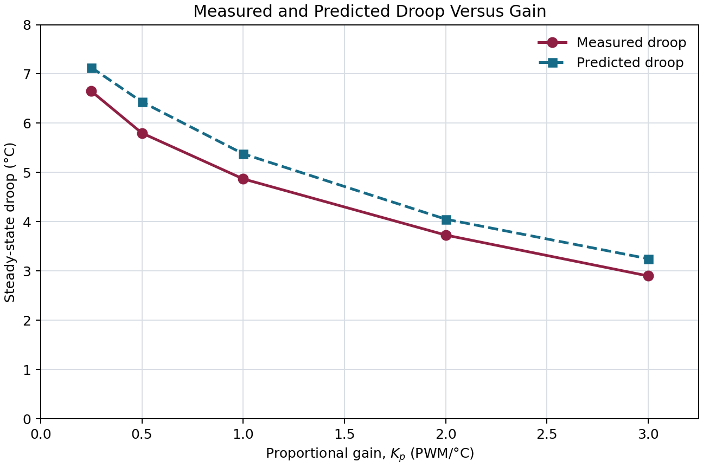

# Part 4: Predict Droop From Module 4

For heating, use the corrected Module 4 susceptibility

$$
\chi_{T,h}=0.4872\ ^\circ\mathrm C/\text{PWM count}.
$$

With a setpoint temperature of 30 °C and an ambient temperature of 22 °C, the initial temperature difference is 8 °C. The predicted steady-state droop is

$$
T_{\mathrm{set}}-T_{\mathrm{ss}}
=\frac{T_{\mathrm{set}}-T_{\mathrm{amb}}}
{1+\chi_{T,h}K_p}
=\frac{8}{1+0.4872K_p}.
$$

The product L = χₜ,ₕKₚ is dimensionless because

$$
\left(\frac{^\circ\mathrm C}{\text{PWM count}}\right)
\left(\frac{\text{PWM count}}{^\circ\mathrm C}\right)=1.
$$

## Predicted and measured results

| $K_p$ (PWM/°C) | $L=\chi_{T,h}K_p$ | Predicted droop (°C) | Measured droop (°C) | Measured minus predicted (°C) |
|---:|---:|---:|---:|---:|
| 0.25 | 0.1218 | 7.13 | 6.65 | -0.48 |
| 0.50 | 0.2436 | 6.43 | 5.80 | -0.63 |
| 1.00 | 0.4872 | 5.38 | 4.87 | -0.51 |
| 2.00 | 0.9744 | 4.05 | 3.73 | -0.32 |
| 3.00 | 1.4616 | 3.25 | 2.90 | -0.35 |

Both results show the same main trend: increasing Kₚ decreases the steady-state droop. The measured droop is between 0.32°C and 0.63°C smaller than the simple prediction. This level of disagreement is reasonable because the model uses one constant susceptibility and does not include all heat-transfer effects or measurement uncertainty.
